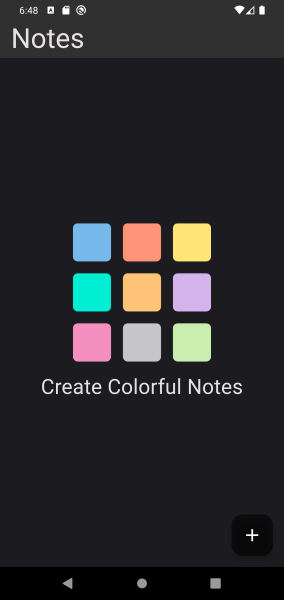
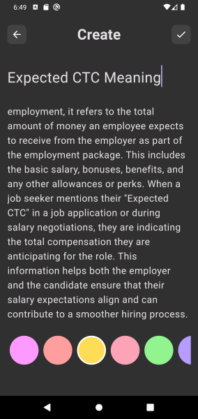
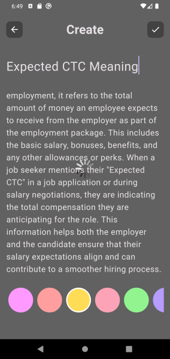
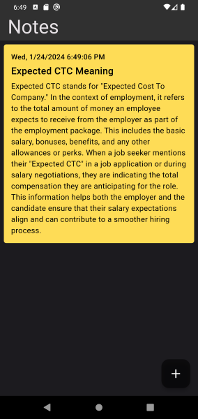
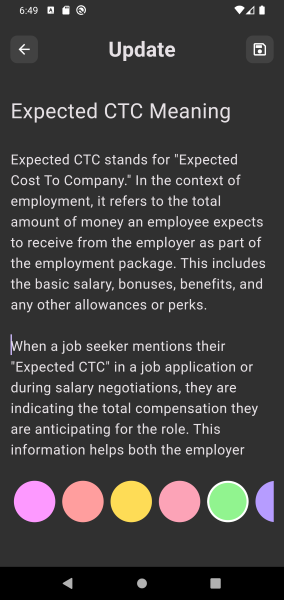
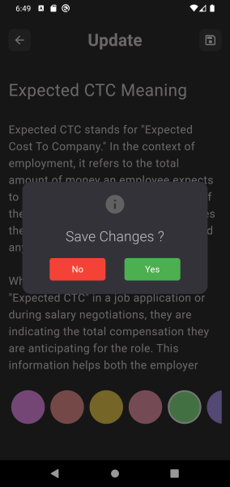
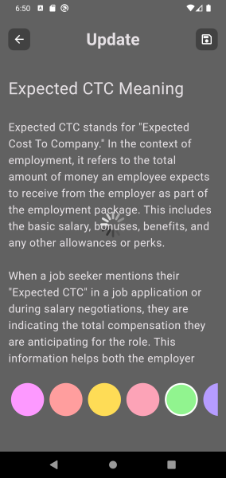
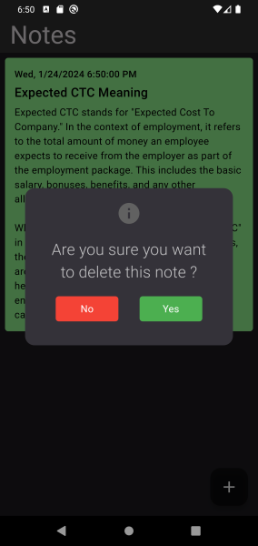

# Notes
* Flutter SDK: 3.16.8
* Dart SDK: 3.2.5

# Contents:
* Just save text notes
* For database used firebase

# Feature
* Save, Update and Delete Text Notes

# Dependencies:
* cloud_firestore: ^4.14.0
* firebase_core: ^2.24.2
* fluttertoast: ^8.2.4
* intl: ^0.19.0

# The Project:

You can run this project:

1. Direct on Android Studio Emulator by this [link](https://github.com/RashadZA/notes.git)
2. Physical Device. [Apk_link](https://drive.google.com/file/d/1w3e-v8qXv-TXi93PtGfQ1oboypvDDW4x/view?usp=sharing)

# How to Use the Project:
* Just install APK and explore features.

## APP Screenshots:

